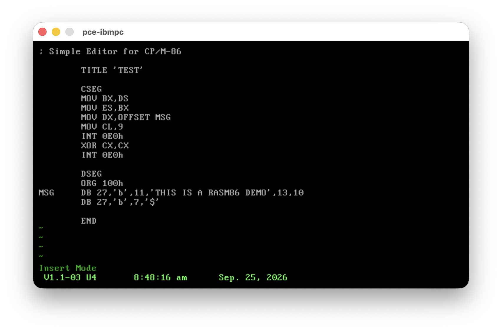

# Vi Editor for CP/M-86

A port of **STevie** (ST Editor for VI Enthusiasts, by Tim Thompson) to
**CP/M-86** on IBM-PC compatible hardware, compiled with **Aztec C v4.2**.



---

## Why vi on CP/M-86?

CP/M-86 ships with `ed` — a line-oriented editor inherited from DEC OSes.
While powerful for scripting, `ed` is notoriously difficult to use
interactively: you work blind, with no visible context of the file, no
cursor, and a command syntax that takes time to learn.

There is no lightweight **screen-mode** editor for CP/M-86.
Most available options are either proprietary, CP/M-80 only, or require
a specific hardware terminal or heavier. This port of STevie fills that gap:
a familiar, full-screen vi experience that runs on standard IBM-PC
CP/M-86 hardware with nothing more than a VT-52 or VT-100 compatible
terminal emulator.

---

## Background

STevie was originally written by Tim Thompson for the Atari 520 ST and later
ported to various CP/M-80 machines. This version targets **CP/M-86** on
IBM-PC hardware. The terminal type is selected at compile time — only
`window.c` and `edit.c` differ between builds; all other objects are shared.

---

## Features

- Full vi normal-mode command set (movement, insert, append, delete, yank,
  put, undo, search, `:` command line)
- Keyboard input via **BDOS function 6** — reads raw key codes with a 64-byte
  ring buffer so fast typists don't lose keystrokes
- Composite / extended key support: arrow keys, Home, End, PgUp, PgDn
- Two terminal builds:

| Binary | Terminal | `window.c` flags |
|--------|----------|------------------|
| `vivt52.cmd`  | VT-52 escape sequences      | `-D__CPM86__ -D__VT52__` |
| `vivt100.cmd` | ANSI / VT-100 escape sequences | `-D__CPM86__ -D_VT100_` |

---

## Building

Requires the Aztec C 86 cross-development toolchain
(`aztec42_cc`, `aztec42_link`, `aztec42_sqz`) on the PATH, available from
[tsupplis/cpm86-crossdev](https://github.com/tsupplis/cpm86-crossdev),
and **cpmtools** (`cpmcp`, `cpmrm`, `cpmls`) for disk image management.

```sh
# Build both terminal variants
make

# Build and package as a zip for distribution
make dist          # produces vi-bin.zip

# Copy binaries to CP/M-86 test disk image
make cpmtest.img

# Run under the PCE CP/M-86 emulator (or emu2 from cpm86-crossdev)
make test
```

---

## Source layout

| File | Purpose |
|------|---------|
| `window.c` | All platform-specific I/O — screen, cursor, keyboard |
| `main.c` | Startup, screen/file allocation, update loop |
| `edit.c` | Insert / append / replace mode |
| `normal.c` | Normal-mode command dispatch |
| `cmdline.c` | `:` command-line parser (`:w`, `:q`, `:e`, …) |
| `linefunc.c` | Line navigation helpers |
| `misccmds.c` | Miscellaneous vi commands |
| `help.c` | Built-in help text |
| `hexchars.c` | Hex / octal character display tables |
| `stevie.h` | Shared externs and defines |

### `window.c` build sections

```
#if defined(__CPM86__)
    #if defined(__VT52__)   ← VT-52 escape sequences
    #elif defined(_VT100_)  ← ANSI / VT-100 escape sequences
```

---

## Command Reference

### Movement

| Command | Action |
|---------|--------|
| `h` `j` `k` `l` | Left / down / up / right |
| `b` | Back one word |
| `w` | Forward one word |
| `^` or `0` | Beginning of line |
| `$` | End of line |
| `[#]G` | Go to line `#` (no count = last line) |
| `^F` | Forward one screen |
| `^B` | Back one screen |
| `^D` | Down 10 lines |
| `^U` | Up 10 lines |
| `^G` | Show file info |
| `^L` | Redraw screen |

### Insert / Replace

| Command | Action |
|---------|--------|
| `i` | Insert before cursor |
| `a` | Append after cursor |
| `o` | Open new line below, enter insert mode |
| `r <c>` | Replace single character under cursor with `<c>` |
| `R` | Enter replace mode (overwrite); `ESC` to exit |
| `ESC` | Exit insert or replace mode, return to normal |

### Delete

| Command | Action |
|---------|--------|
| `x` | Delete character under cursor |
| `[#]dd` | Delete `#` lines (default 1) |
| `dw` | Delete word |
| `D` or `d$` | Delete to end of line |

### Change

| Command | Action |
|---------|--------|
| `cc` | Change entire line (delete line, enter insert) |
| `cw` | Change word |
| `C` or `c$` | Change to end of line |

### Yank & Put

| Command | Action |
|---------|--------|
| `[#]yy` | Yank `#` lines into buffer (default 1) |
| `p` | Put yanked/deleted lines after current line |
| `P` | Put yanked/deleted lines before current line |

### Miscellaneous

| Command | Action |
|---------|--------|
| `u` | Undo last change |
| `.` | Redo last insert or delete |
| `J` | Join current line with next |
| `[#]>>` | Indent `#` lines right by one tab (default 1) |
| `[#]<<` | Indent `#` lines left by one tab (default 1) |
| `H` | Show built-in help screen |

### Search

| Command | Action |
|---------|--------|
| `/str` | Search forward for `str` |
| `?str` | Search backward for `str` |
| `n` | Repeat last search |
| `//` or `??` | Repeat last search (command-line form) |

### `:` Command line

| Command | Action |
|---------|--------|
| `:w` | Write file |
| `:w <file>` | Write to `<file>` |
| `:wq` or `:x` | Write and quit |
| `:q` | Quit (refuses if unsaved changes) |
| `:q!` | Quit unconditionally |
| `:e <file>` | Edit `<file>` |
| `:e!` | Re-read current file, discarding changes |
| `:r <file>` | Read `<file>` and insert after current line |
| `:f` | Show current filename and size |
| `:f <name>` | Rename current file (in-editor) |
| `:.=` | Show current line number and character offset |
| `:$=` | Show total number of lines |
| `:set oct` | Display non-printable characters in octal |
| `:set hex` | Display non-printable characters in hex |
| `:set dec` | Display non-printable characters in decimal |
| `:h` or `:help` | Show built-in help screen |

---

## Terminal key sequences

The arrow keys, Home, PgUp, PgDn and End send different byte sequences
depending on the terminal type.

### VT-52 (`vivt52.cmd`)

VT-52 cursor keys send a two-byte sequence: `ESC` followed by a single letter.

| Key | Sequence | vi action |
|-----|----------|-----------|
| ↑ Up    | `ESC A` | `k` — move up one line |
| ↓ Down  | `ESC B` | `j` — move down one line |
| → Right | `ESC C` | `l` — move right one char |
| ← Left  | `ESC D` | `h` — move left one char |
| Home    | `ESC H` | `0` — beginning of line |
| PgUp    | `ESC I` | `^B` — back one screen |
| End     | `^Z` (0x1A) | `$` — end of line |
| PgDn    | `^J` (0x0A) | `^F` — forward one screen |

### VT-100 / ANSI (`vivt100.cmd`)

VT-100 cursor keys send a three-byte sequence: `ESC [` followed by a letter.

| Key | Sequence | vi action |
|-----|----------|-----------|
| ↑ Up    | `ESC [ A` | `k` — move up one line |
| ↓ Down  | `ESC [ B` | `j` — move down one line |
| → Right | `ESC [ C` | `l` — move right one char |
| ← Left  | `ESC [ D` | `h` — move left one char |
| Home    | `ESC [ H` | `0` — beginning of line |
| PgUp    | `ESC [ I` | `^B` — back one screen |
| End     | `^Z` (0x1A) | `$` — end of line |
| PgDn    | `^J` (0x0A) | `^F` — forward one screen |

> End and PgDn arrive as bare control codes with no ESC prefix on both
> terminal types, as sent by the IBM-PC CP/M-86 BDOS keyboard handler.

---

## Requirements

- **Aztec C 86 v4.2** cross-compiler (`aztec42_cc`, `aztec42_link`, `aztec42_sqz`) —
  from [tsupplis/cpm86-crossdev](https://github.com/tsupplis/cpm86-crossdev)
- **cpmtools** (`cpmcp`, `cpmrm`, `cpmls`) to manage CP/M disk images
- **zip** for `make dist`
- A CP/M-86 emulator for `make test` — optional; two suitable options:
  - **PCE** CP/M-86 emulator (`cpm86`)
  - **emu2** — also available from
    [tsupplis/cpm86-crossdev](https://github.com/tsupplis/cpm86-crossdev)

---

## Credits

- **Tim Thompson** — original STevie for the Atari ST
- **Jon Bradbury** — CP/M-80 port for the Philips P2000C
- This CP/M-86 port adds IBM-PC keyboard handling, dual terminal builds,
  and a cross-compilation Makefile
